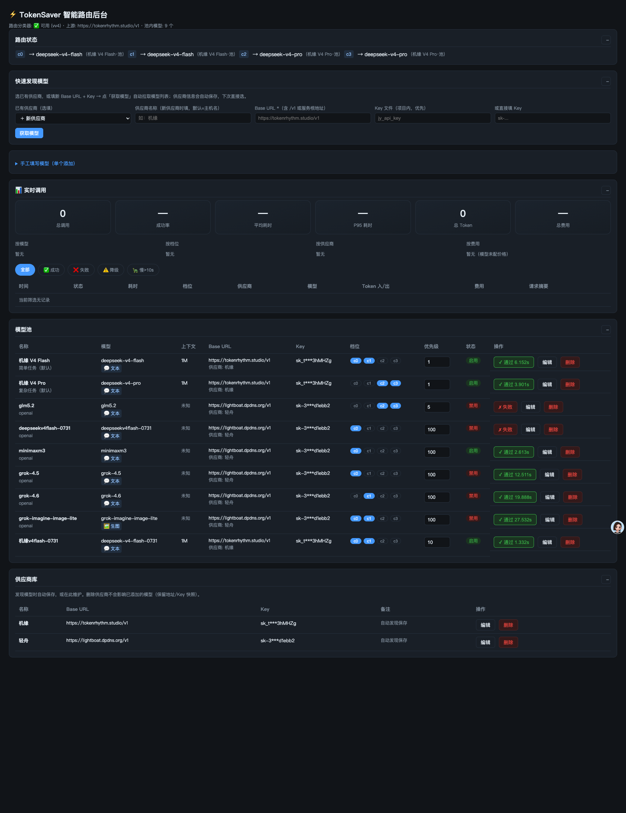
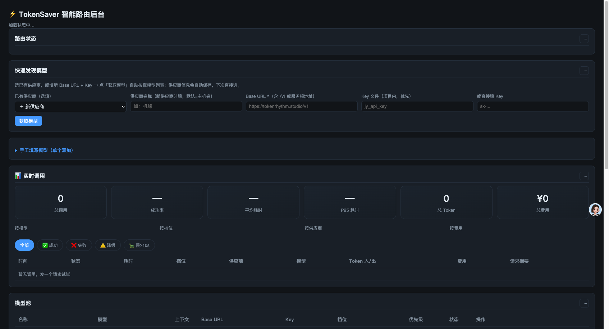

# TokenSaver / Smart Router

**中文** | [English](README.en.md)

OpenAI 兼容的**智能路由省钱网关**——自动判断问题复杂度（简单/中等/复杂），简单问题走便宜轻量模型、复杂问题走强模型，让你不用手动选模型也能省 token 钱。

内置 OpenSquilla 智能分类器（已 vendor 化进仓库），配合**模型池 + 供应商库**后台管理，发现式添加模型，一键验证模型真实可用。

## ✨ 特性

- 🧠 **智能路由**：OpenSquilla SquillaRouter 自动判档（c0-c3），简单→轻量模型、复杂→强模型
- 🔌 **OpenAI 兼容**：`POST /v1/chat/completions`（非流式 + SSE 流式），任何客户端填 `base_url=http://localhost:20130/v1` + `model=auto` 即用
- 🗂️ **模型池 + 供应商库**：后台页面管理多个模型，每个模型独立 base_url/Key/档位/优先级
- 🔍 **发现式添加**：填 Base URL + Key → 点「获取模型」→ 自动拉取模型列表 → 勾选批量入池
- ✅ **真实功能验证**：测试不是连通性检查——发 `1+1=?` 短消息校验**真有回复内容且答对**，生图模型自动走生图接口；通过绿/失败红，持久显示
- 📊 **实时调用监控**：统计卡（总量/成功率/平均/P95/总 Token/总费用）、按模型/档位/供应商/**费用**分布、失败/降级/浪费告警、请求摘要明细、流式 Token 记账
- 💸 **省钱洞察**：按模型费用分布 + "简单任务走高档模型"浪费告警，一眼看出钱花哪了
- 🔄 **自动降级链**：高档模型失败自动降级到低档，保证请求能出结果
- 📏 **上下文自动识别**：从 `/v1/models` 或本地模型目录自动带出上下文长度（1M/200K…）

## 📸 截图



| 顶部统计 | 模型池 |
|---|---|
|  |  |

## 🏗️ 架构

```
任意 OpenAI 客户端 (DSH / Hermes / curl ...)
        │  base_url=http://localhost:20130/v1, model=auto
        ▼
┌─────────────────────────────┐
│  TokenSaver 网关 (FastAPI)  │
│  1. classify() 判档 c0-c3   │
│  2. 查模型池 → 选模型        │
│  3. 直连供应商 API 转发      │
└─────────────────────────────┘
        │
        ├── 供应商 A (机缘 tokenrhythm.studio) ── flash / pro
        ├── 供应商 B (轻舟 lightboat.dpdns.org) ── glm5.2 / minimaxm3 ...
        └── 供应商 C ...（后台自由添加）

分类器：vendor/opensquilla（SquillaRouter 模型资产已内置仓库，Apache-2.0）
```

> 已彻底脱离 9router：路由判断、转发、降级全部由 TokenSaver 自己完成。

## 🚀 快速开始

### 依赖

- Python 3.10+
- `pip install -r requirements.txt`（fastapi / httpx / uvicorn；分类器模型资产在 `vendor/` 已内置）

### 启动

```bash
cd tokensaver

# 1. 配置 API Key（推荐：写入项目目录 600 权限文件，后台填 Key 文件路径）
#    机缘示例：把 key 写入 jy_api_key，后台选 Key 文件 jy_api_key
#    或直接在后台页面填 Key

# 2. 启动网关（首次加载路由模型，约数秒）
python3 gateway.py
#   或 uvicorn gateway:app --host 0.0.0.0 --port 20130

# 3. 冒烟测试
curl http://localhost:20130/v1/chat/completions \
  -H "Content-Type: application/json" \
  -d '{"model":"auto","messages":[{"role":"user","content":"1+1等于几"}]}'

# 流式
curl -N http://localhost:20130/v1/chat/completions \
  -H "Content-Type: application/json" \
  -d '{"model":"auto","messages":[{"role":"user","content":"写一个B树实现"}],"stream":true}'
```

### 后台管理页面

浏览器打开 **http://localhost:20130/admin**

| 功能 | 说明 |
|---|---|
| 快速发现模型 | 填 Base URL + Key → 获取模型 → 勾选批量入池（供应商自动保存） |
| 模型池 | 测试（1+1 验证 / 生图验证）、编辑、删除、启用/禁用切换、优先级就地改 |
| 供应商库 | 管理供应商（地址/Key 自动保存，下次直接选） |
| 实时调用 | 统计卡 + 分布 + 失败/降级告警 + 明细过滤（每条可👍/👎纠错） |
| 🧠 自学习 | 样本采集（只存特征向量）、纠错反馈、训练门控/一键训练、模型版本/上线状态 |

### 示例配置

```bash
cp providers.example.json providers.json          # 供应商模板
cp models_pool.example.json models_pool.json      # 模型池模板
```

> ⚠️ `models_pool.json` / `providers.json` / `*_api_key` 含真实密钥，已加入 `.gitignore`，**不要提交**。

## 🎛️ 路由档位

| 档位 | 含义 | 建议模型 |
|---|---|---|
| c0 | 最简单（闲聊/单步问答） | 轻量 flash |
| c1 | 简单 | 轻量 flash |
| c2 | 中等（分析/代码） | 强模型 pro |
| c3 | 复杂（深度推理/长文） | 最强模型 |

- 升级词：用户说"用最好的模型/深度思考" → 强制 c3
- 显式模型：客户端指定具体模型名 → 直接透传（查池匹配）

## 📡 API

| 端点 | 说明 |
|---|---|
| `POST /v1/chat/completions` | 聊天（auto 自动路由 / 指定模型透传） |
| `GET /v1/models` | 模型列表 |
| `GET /healthz` | 健康检查 |
| `GET /admin` | 后台管理页面 |
| `GET/POST /admin/api/pool` | 模型池 CRUD |
| `POST /admin/api/pool/{id}/test` | 功能验证（文本 1+1 / 生图） |
| `GET/POST /admin/api/providers` | 供应商 CRUD |
| `POST /admin/api/discover` | 发现模型（自动保存供应商） |
| `GET /admin/api/usage` | 实时调用统计 |
| `GET /admin/api/selflearning/status` | 自学习状态（样本数/门控/版本/训练任务） |
| `POST /admin/api/selflearning/feedback` | 纠错反馈（up/down/neutral） |
| `POST /admin/api/selflearning/train` | 触发一次训练（后台） |
| `GET /admin/api/status` | 路由状态预览 |

## 📄 许可

- 本项目：Apache-2.0（见 LICENSE）
- 内置分类器来自 [OpenSquilla](https://github.com/opensquilla/opensquilla)（Apache-2.0，模型资产随仓库分发）
- 灵感：OpenSquilla 智能路由 + 开源中转网关生态

## 🧑‍💻 开发

- `CHANGELOG.md`：版本历史
- `docs/`：设计/配置/FAQ
- `CONTRIBUTING.md`：贡献指南
