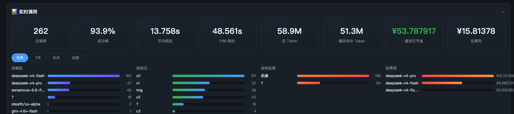

<div align="center">

# 💰 TokenSaver · Smart Router

**OpenAI 兼容的智能路由省钱网关**
简单问题自动走轻量模型，复杂问题才动强模型——不用手动选模型，token 费用直省一半起

[](LICENSE)
[](https://www.python.org/)
[](#快速开始)
[](https://github.com/lmcsh9527/smart-router/releases)
[](https://github.com/lmcsh9527/smart-router/stargazers)



*实时调用监控 —— 总量 / 成功率 / P95 / Token / 费用，每一分钱花在哪一眼看清*

**中文** · [English](README.en.md)

</div>

---

## 为什么需要它

接了多个大模型供应商后，最常见的两种浪费：

- **杀鸡用牛刀**：闲聊、单步问答也调最强模型，费用翻好几倍
- **手动选模型累**：每条消息先想想"这题难不难"，注意力被打断

TokenSaver 在中间加一层网关：客户端永远只填 `model=auto`，内置分类器自动判断问题复杂度（c0-c3 四档），**简单问题路由到轻量模型、复杂问题才升级强模型**，失败还会自动沿降级链兜底。

## ✨ 特性

| | 特性 | 说明 |
|---|---|---|
| 🧠 | **智能判档路由** | OpenSquilla SquillaRouter 自动判档（c0-c3），vendor 化内置、离线可用 |
| 🔌 | **OpenAI 兼容** | 非流式 + SSE 流式；任何客户端填 `base_url` + `model=auto` 即用 |
| 🗂️ | **模型池 + 供应商库** | 后台可视化管理，每个模型独立 base_url / Key / 档位 / 优先级 |
| 🔍 | **发现式添加** | 填 Base URL + Key → 一键拉取模型列表 → 勾选批量入池 |
| ✅ | **真实功能验证** | 不是 ping 通就过——发 `1+1=?` 校验真有正确回复；生图模型走生图接口 |
| 📊 | **实时调用监控** | 总量/成功率/P95/Token/费用统计卡，按模型/档位/供应商分布，请求明细可 👍👎 纠错 |
| 💸 | **省钱洞察** | 费用分布 + "简单任务走高档模型"浪费告警 |
| 🔄 | **自动降级链** | 高档失败/超时自动降级低档，保证请求出结果 |
| 🧠 | **自学习**（实验） | 样本采集、纠错反馈、训练门控、模型版本管理 |

## 📸 截图

| 实时调用监控 | 模型池 |
|---|---|
|  |  |

## 🚀 快速开始

```bash
bash install.sh             # ① 依赖安装 + 配置初始化
bash install.sh --launchd   # ② macOS 开机自启 + 崩溃保活（可选）
bash scripts/doctor.sh      # ③ 健康自检
```

然后打开后台 **http://localhost:20130/admin** 添加你的模型渠道（Base URL + Key → 获取模型 → 入池），客户端这样接：

```
Base URL: http://localhost:20130/v1
Model:    auto          ← 自动判档路由
API Key:  随意填（本地网关不校验）
```

<details>
<summary><b>手动安装 / 冒烟测试</b></summary>

```bash
# 依赖：Python ≥3.10
pip install -r requirements.txt     # 分类器模型资产在 vendor/ 已内置
python3 gateway.py                  # 或 uvicorn gateway:app --host 0.0.0.0 --port 20130

# 冒烟测试
curl http://localhost:20130/v1/chat/completions \
  -H "Content-Type: application/json" \
  -d '{"model":"auto","messages":[{"role":"user","content":"1+1等于几"}]}'
```

配置模板：`cp models_pool.example.json models_pool.json`
</details>

<details>
<summary><b>接入 DSH Desktop</b></summary>

后台提供一键 DSH 接入；或手工在 `settings.yaml` 加 provider（详见 [docs/dsh-integration.md](docs/dsh-integration.md)）。
</details>

## 🎛️ 路由档位

| 档位 | 含义 | 建议模型 |
|---|---|---|
| c0 | 最简单（闲聊/单步问答） | 轻量 flash |
| c1 | 简单 | 轻量 flash |
| c2 | 中等（分析/代码） | 强模型 pro |
| c3 | 复杂（深度推理/长文） | 最强模型 |

- 升级词：用户说"用最好的模型/深度思考" → 强制 c3
- 显式模型：客户端指定具体模型名 → 直接透传（查池匹配）

## 🏗️ 架构

```
任意 OpenAI 客户端 (DSH / Hermes / curl ...)
        │  base_url=http://localhost:20130/v1, model=auto
        ▼
┌─────────────────────────────┐
│  TokenSaver 网关 (FastAPI)  │
│  1. classify() 判档 c0-c3   │
│  2. 查模型池 → 选模型        │
│  3. 直连供应商 API 转发      │
└─────────────────────────────┘
        │
        ├── 供应商 A ── flash / pro
        ├── 供应商 B ── 其他模型 ...
        └── 供应商 C ...（后台自由添加）

分类器：vendor/opensquilla（SquillaRouter 模型资产已内置仓库）
```

> 已彻底脱离 9router：路由判断、转发、降级全部由 TokenSaver 自己完成。

## 📡 API 一览

| 端点 | 说明 |
|---|---|
| `POST /v1/chat/completions` | 聊天（auto 自动路由 / 指定模型透传） |
| `GET /v1/models` | 模型列表 |
| `GET /healthz` | 健康检查 |
| `GET /admin` | 后台管理页面 |
| `GET/POST /admin/api/pool` | 模型池 CRUD |
| `POST /admin/api/pool/{id}/test` | 功能验证（文本 1+1 / 生图） |
| `GET/POST /admin/api/providers` | 供应商 CRUD |
| `POST /admin/api/discover` | 发现模型（自动保存供应商） |
| `GET /admin/api/usage` | 实时调用统计 |
| `GET /admin/api/selflearning/status` | 自学习状态 |
| `POST /admin/api/selflearning/feedback` | 纠错反馈 |

更多文档：[docs/config.md](docs/config.md) · [docs/design.md](docs/design.md) · [docs/faq.md](docs/faq.md) · [CHANGELOG.md](CHANGELOG.md)

## 🔒 密钥安全

`models_pool.json` / `providers.json` / `*_api_key` 含真实密钥与渠道信息，均已加入 `.gitignore`，**不会也不应提交**。后台页面展示的 Key 均为脱敏形式。

## 📄 许可

- 本项目：MIT（见 [LICENSE](LICENSE)）
- 内置分类器来自 [OpenSquilla](https://github.com/opensquilla/opensquilla)（Apache-2.0，模型资产随仓库分发）

## 🧑‍💻 开发

- [CONTRIBUTING.md](CONTRIBUTING.md)：贡献指南
- [docs/design.md](docs/design.md)：设计文档
